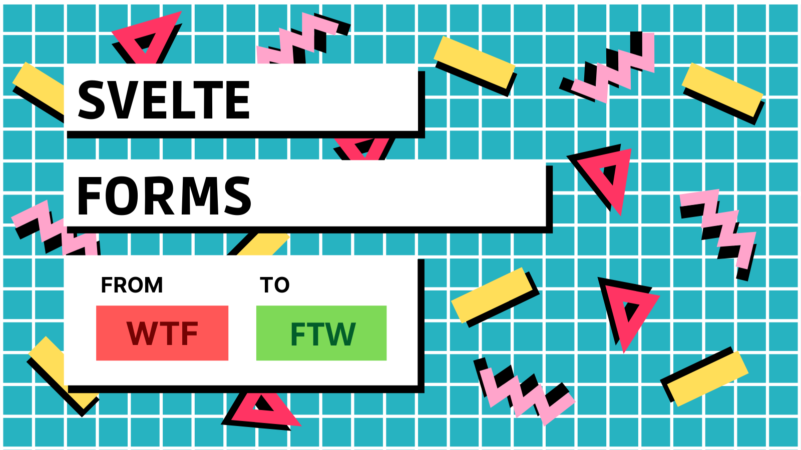

# svelte-forms-starter

> :green_book: A starter project for my book - [**Svelte Forms: From WTF to FTW!**](https://gumroad.com/l/svelte-forms)



## How to Run

This app uses [Snowpack](https://snowpack.dev) as bundler.

```
$ npm i && npm start
```

Open http://localhost:3000 to view it in the browser.

## Linting

This starter comes with ESlint and Prettier integration that should work in your editor if it has support for it.

To run manually.

```
# to check the errors
$ npm run lint

# to fix the errors
$ npm run fix
```

There is also integration with `svelte-check`. It checks your files for errors when the project is running.

## Examples

For the examples to look good paste them inside the div with class `generic` in the `App.svelte` file.

